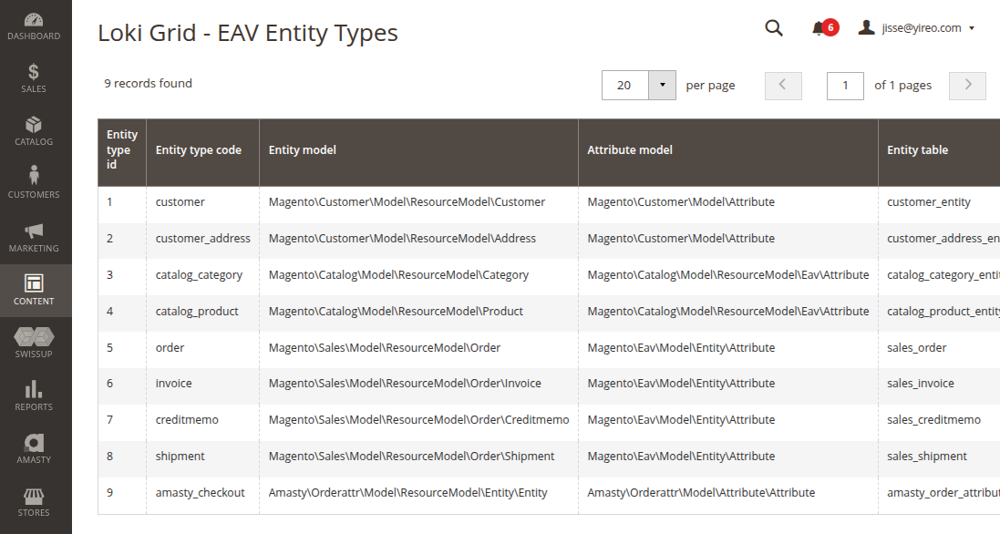

# YireoTraining_ExampleLokiAdminEavEntityType

<!-- badges.specs.start -->


<!-- badges.specs.end -->


**This Magento 2 module demos the usage of [Loki_AdminComponents](https://github.com/LokiExtensions/Loki_AdminComponents)**

### Installation
```bash
composer require yireo-training/magento2-example-loki-admin-eav-entity-type@dev
bin/magento module:enable YireoTraining_ExampleLokiAdminEavEntityType
```

### Usage
Navigate via the menu **Content > EAV Entity Types (Loki)**.

Note that this example module is not about the usage, it is about the code. See how little code was involved to create this grid.



## Current status

<!-- badges.test.start -->


<!-- badges.test.end -->
